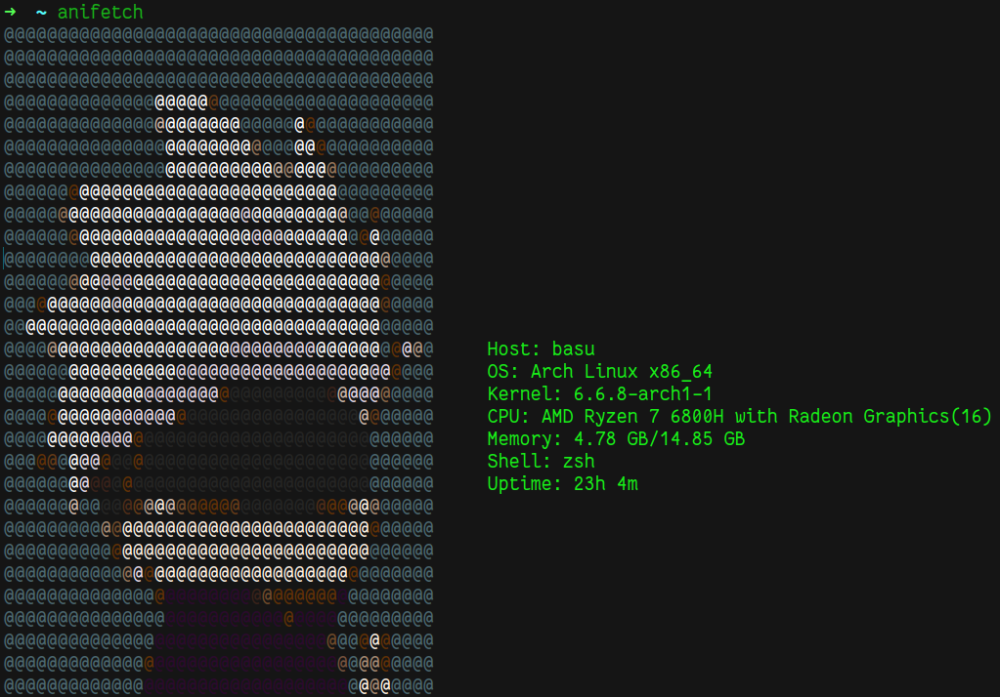

# Anifetch

Anifetch is a lightweight and cute fetch utility written in Rust that combines system information with adorable chibi anime characters. This utility prints a chibi anime character alongside key system details, creating a delightful terminal experience.


<p align="center"></p>

## Features

- Fetches system information and displays it in a visually appealing manner.
- Integrates chibi anime characters for a touch of cuteness.
- Lightweight and efficient, providing essential system details in a single glance.

## Quickstart

To use this application, you should have Rust installed. If you do not have it, install it from [here](https://www.rust-lang.org/tools/install)

**1. Get the repo**

```
git clone https://github.com/MashyBasker/anifetch
cd anifetch
```

**2. Build the application**

```bash
$ chmod +x build.sh
$ ./build.sh
```